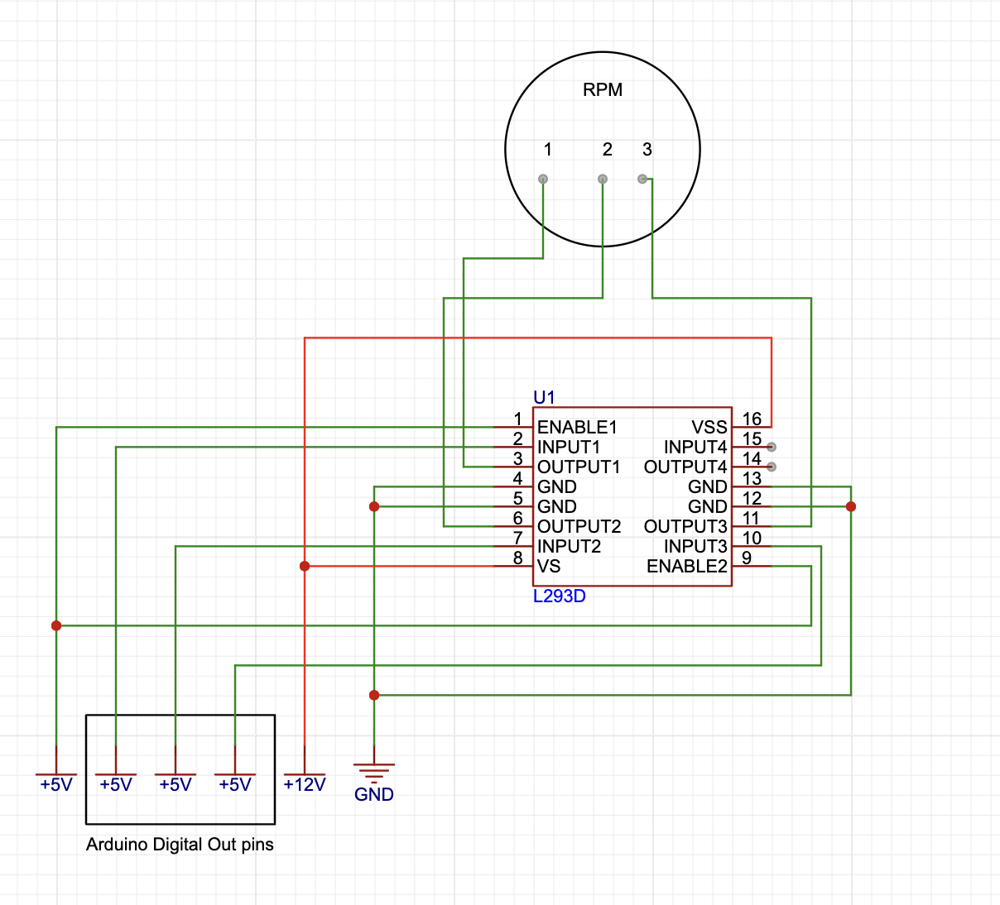
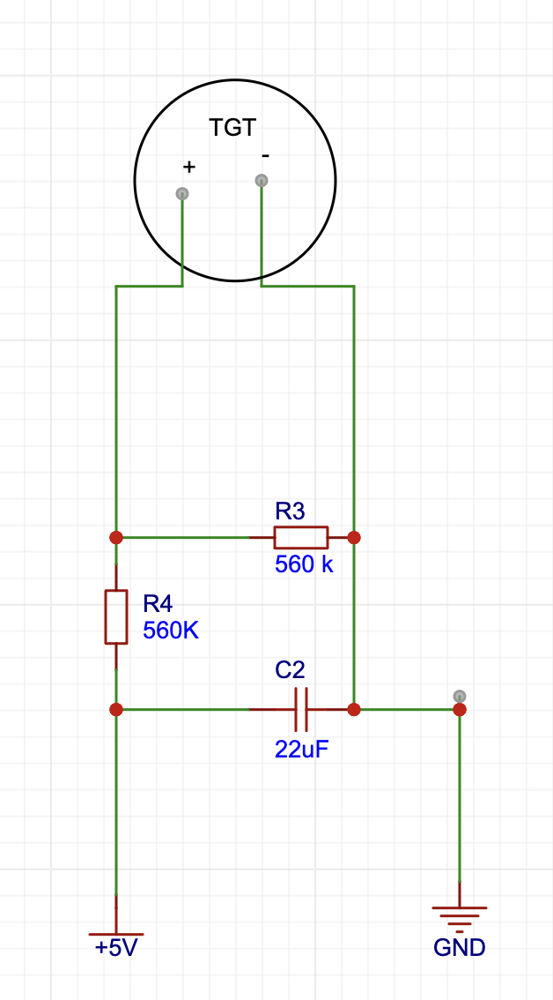
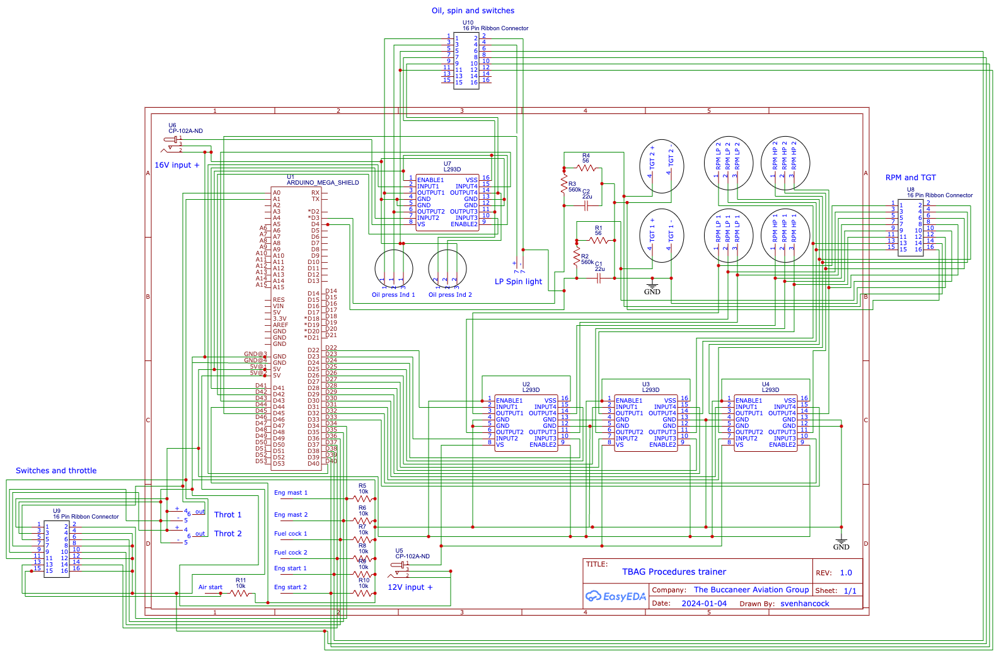

# Circuit diagrams

This folder contains circuit diagrams for the circuits used in this Arduino project. The circuit diagrams were drawn in easyEDA, and the files for it are included here.

Note that the dampening reistor in the TGT circuit should be 56 Ohms, as in the whole circuit.

