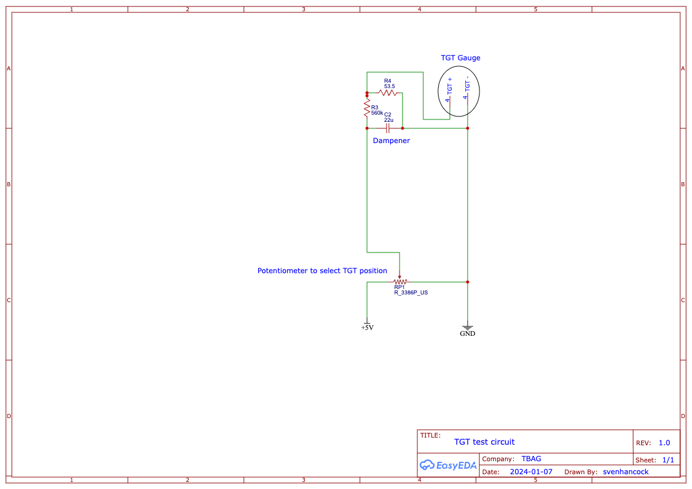

# Introduction

This contains code and circuit diagrams to test buccaneer instruments.

## bucc\_procedures

Code to test a buccaneer TGT gauge (jet pipe temperature). The circuit required is shown belo.

